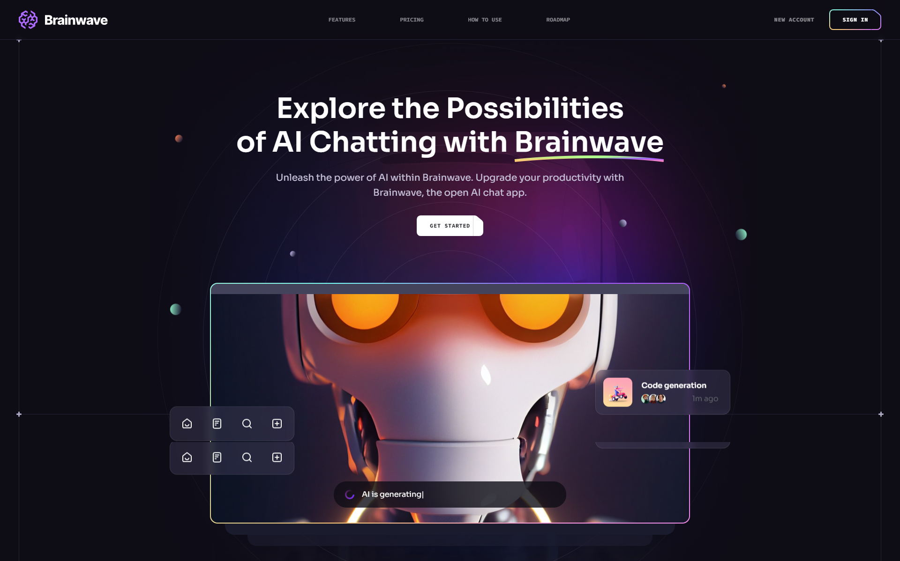

<div align="center">
  <br />
    
  <br />
  <br />
  <div>
    
    
    
  </div>
  <br />
  <br />
  <div align="center">
     Live Website - https://brainwave-parallax.vercel.app/
  </div>
</div>

## <a name="features">🔋 Features</a>

- **Modern Landing Page:**
  Immerse users in a contemporary design featuring captivating animations and a sophisticated layout.

- **Responsive Navigation:**
  Navigate seamlessly with a user-friendly navigation bar, complete with a colorful button that transforms into an animated hamburger menu on smaller screens.

- **Parallax Effect:**
  Experience a visually stunning journey as elements on the page respond to your scroll, creating a captivating parallax effect.

- **Bento Box Design Layout:**
  Following the design principles of popular companies like Apple, Brainwave adopts the Bento Box layout, offering an organized and intuitive user interface.

and many more, including code architecture and reusability

## <a name="tech-stack">⚙️ Tech Stack</a>

- Vite
- React.js
- Tailwind CSS

## <a name="getting-started">🤸 Getting Started</a>

**Cloning the Repository**

```bash
git clone https://github.com/rakhaantareza/brainwave.git
cd brainwave
```

**Installation**

Install the project dependencies using npm:

```bash
npm install
```

**Running the Project**

```bash
npm run dev
```

Open [http://localhost:5173](http://localhost:5173) in your browser to view the project.

## Contributing

I welcome contributions from the community. If you have ideas, suggestions, or improvements, feel free to open an issue or submit a pull request.
